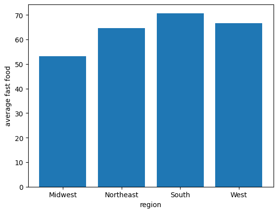

🍔 Fast Food Spending Analysis
🌟 What is this project about?

This project takes a look at how much people in different U.S. states spend on fast food. Instead of just showing numbers, the goal is to transform raw CSV data into insights by applying:

🧹 Cleaning → making the dataset tidy and ready to use

🎨 Visualization → spotting trends across regions and states

⚙️ Feature Engineering → creating new variables that explain spending better

📈 Exploration → finding relationships (like region vs spending levels)

Think of it as turning a spreadsheet into a story about food habits across America.
📂 What’s inside this repo?

Fast_Food.ipynb → The Jupyter Notebook where all the magic happens (cleaning, exploring, and visualizing).

fast_food_dataset.csv → The dataset (100 rows, 3 columns).

requirements.txt → List of Python libraries needed.

README.md → This file you’re reading now.
🗂️ About the dataset

state → U.S. state name (Alabama, Alaska, etc.)

region → U.S. region (South, West, Midwest, Northeast)

fast_food_millions → Annual spending on fast food in millions of dollars

Example (first 5 rows):

state	region	fast_food_millions
Alabama	South	83
Alaska	West	80
Arizona	West	81
Arkansas	South	45
California	West	52
🎯 What you’ll see in the notebook

📊 Region-wise spending comparisons (South vs West, etc.)
    
🏆 Top spenders and low spenders (state-level)

📦 Engineered features like “Above/Below Average Spending”

🔥 Visuals: bar charts

📝 Why this project?
This isn’t just about fast food 🍟.
It’s about learning data storytelling — how to take a plain dataset, clean it, explore it, and pull out insights that people can understand.